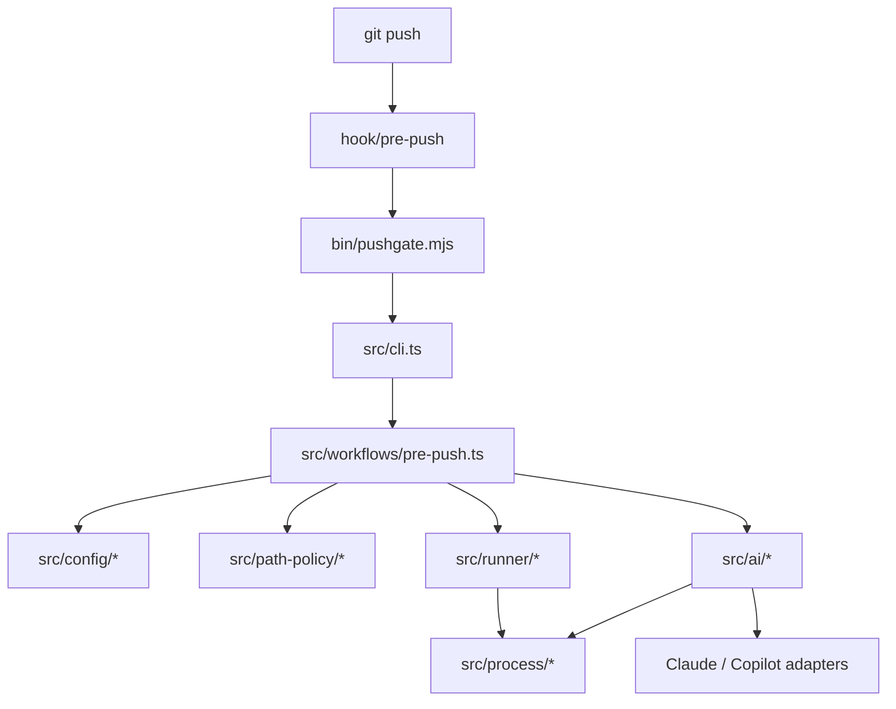

# Pushgate Architecture Overview

Pushgate is organized around a small Git hook, a managed runner, and modules
that keep product contracts concentrated behind stable interfaces.

## Mental Model

The installed Git hook is intentionally small. It verifies that a compatible
runner exists, then delegates all behavior to `pushgate pre-push`.

The runner performs one ordered workflow:

1. Drain Git hook stdin.
2. Resolve the repository and skip-control state.
3. Load and normalize `.pushgate.yml`, unless all local checks are skipped.
4. Resolve changed files once when later phases need them.
5. Run deterministic local checks.
6. If deterministic checks pass, run local AI review unless skipped or disabled.
7. Return a Git-meaningful exit code.

CI and PR policy remain the final enforcement layer. Pushgate improves local
feedback before code reaches that layer.

## Architectural Layers

| Layer | Responsibility | Representative files |
|---|---|---|
| Product contract | User workflow, config examples, templates | `README.md`, `templates/*.yml` |
| Hook and install | Managed runner placement and thin hook delegation | `install.sh`, `hook/pre-push` |
| CLI and workflow | Command dispatch, push wrapper, pre-push phase order | `src/cli.ts`, `src/cli/*`, `src/workflows/*` |
| Configuration | Strict v2 schema, YAML parsing, defaults, provider validation | `src/config/*`, `schemas/pushgate-config-v2.schema.json` |
| Path policy | Target-ref resolution, merge-base selection, diff parsing, ignore filtering, named ranges | `src/path-policy/*`, `src/git/*` |
| Process execution | Shared child-process mechanics and outcome policy | `src/process/*` |
| Deterministic runner | Built-in policies, plugin checks, configured tools, fail-fast behavior | `src/runner/*` |
| Local AI review | Guardrails, prompt context, provider adapters, output parsing, verdict rendering | `src/ai/*`, `schemas/ai-review-output-v1.schema.json` |
| Distribution | Generated runner and generated validators | `bin/pushgate.mjs`, `src/generated/*`, `scripts/*` |
| Tests | Behavior-level coverage for hook, install, runner, config, path policy, process, and AI | `test/*.test.ts`, `test/support/*` |

## Stable Interfaces

The most important interfaces are the facts callers must know, not only
TypeScript `interface` declarations.

| Interface | Owned by | What callers rely on |
|---|---|---|
| Hook protocol | `hook/pre-push`, `src/cli.ts` | The hook requires protocol `1` before delegating to the runner. |
| `pushgate pre-push` | `src/cli.ts`, `src/workflows/pre-push.ts` | Drains Git hook stdin, runs Pushgate phases, and returns the local verdict. |
| `pushgate push` | `src/cli.ts`, `src/cli/push-args.ts` | Runs a local Pushgate preflight, maps friendly skip flags to one-push Git config, then delegates to `git push --no-verify`. |
| `.pushgate.yml` v2 | `schemas/pushgate-config-v2.schema.json`, `src/config/*` | Strict user config with normalized defaults before modules consume it. |
| Changed-file resolution | `src/path-policy/*` | One normalized changed-file list plus named review and scan ranges. |
| Deterministic check summary | `src/runner/deterministic.ts` | Exit code plus per-check results after policies, plugins, and tools run. |
| Local AI provider adapter | `src/ai/types.ts`, `src/ai/provider-runtime.ts` | Provider-specific execution returns one provider-neutral result. |
| AI review output contract | `src/ai/review-contract.ts` | Every provider response validates against the same strict finding schema. |

## Read First

1. [Domain Model](../domain/model.md)
2. [Runtime Flow](./runtime-flow.md)
3. [Module Map](./modules.md)
4. [Configuration Reference](../reference/configuration.md)
5. [Changed-File Policy](../reference/changed-file-policy.md)
6. [Local AI Review](../reference/local-ai-review.md)
7. [ADRs](../adr/)
