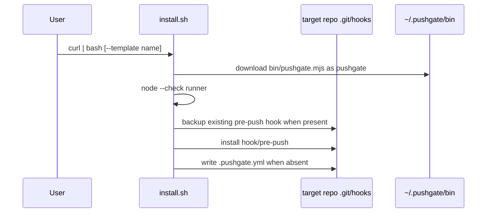
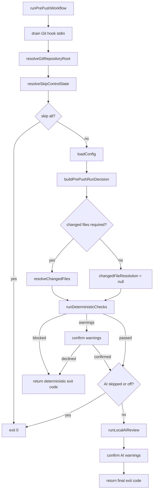
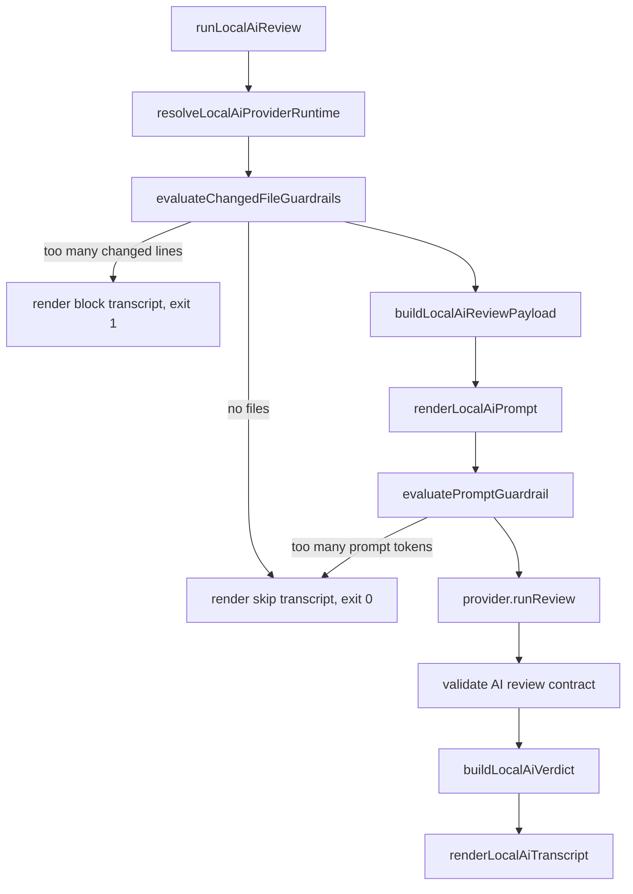

# Pushgate Runtime Flow

This document follows one push through installation, hook delegation,
deterministic checks, local AI review, and local failure semantics.

## Installation

The installer places the runner in `~/.pushgate/bin/pushgate` and installs the
thin hook into the target repository. Project repositories do not need local
Node dependencies at push time.

## Hook Delegation

`hook/pre-push` owns a narrow interface:

1. Resolve the repository root for diagnostics.
2. Resolve the runner path in this order: local `git config pushgate.runner`,
   `PUSHGATE_RUNNER`, then `~/.pushgate/bin/pushgate`.
3. Ensure the runner exists and is executable.
4. Run `pushgate hook-protocol`.
5. Require protocol `1`.
6. `exec pushgate pre-push "$@"`.

The hook does not parse config, inspect changed files, run tools, or invoke AI
providers.

## CLI Dispatch

| Command | Purpose |
|---|---|
| `hook-protocol` | Compatibility handshake for the shell hook. |
| `pre-push` | Internal hook entry point that runs the Pushgate workflow. |
| `push` | Optional wrapper around `git push` that runs local preflight before native push and maps skip flags to Git config. |

Unsupported command shapes return usage output with exit code `64`. Runtime
workflow failures are rendered through `writePushgateError` and return `1`.

## Pre-Push Workflow

Changed files are resolved once and shared between deterministic checks and
local AI. Deleted files remain in the normalized changed-file result for diff
and AI context, but configured tools receive only live current paths.

## Deterministic Phase

The deterministic phase consumes normalized config and normalized changed-file
resolution.

1. Count enabled built-in policies, plugin checks, and configured tools.
2. If none are configured, print a visible no-checks message and pass.
3. Run built-in policies first.
4. Run plugin checks such as Gitleaks.
5. Run configured tools in order.
6. Expand `{changed_files}` into argv entries without shell interpolation.
7. Apply timeout, output-tail, mode, and fail-fast behavior.
8. Return a deterministic check summary and transcript output.

## Local AI Phase

Provider adapters currently exist for Claude and Copilot. Both receive the same
rendered payload and return a provider-neutral review result or provider
failure.

## Failure Semantics

| Failure | Blocking mode | Advisory mode | Off mode |
|---|---|---|---|
| Deterministic blocking check | Blocks | Blocks | Blocks |
| Deterministic warning check | Requires confirmation | Requires confirmation | Requires confirmation |
| Provider missing, unauthenticated, failed, timed out, empty, invalid | Blocks | Warns, then requires confirmation | Not run |
| AI blocking findings | Blocks | Warns, then requires confirmation | Not run |
| AI warning findings only | Requires confirmation | Requires confirmation | Not run |
| Changed-line guardrail exceeded | Blocks before provider invocation | Blocks before provider invocation | Not run |
| Prompt-token guardrail exceeded | Skips local AI only | Skips local AI only | Not run |

Skip controls are intentionally visible:

- `git push --no-verify` bypasses the Git hook entirely.
- `git -c pushgate.skip-all-checks=true push` bypasses all local Pushgate work.
- `git -c pushgate.skip-ai-check=true push` keeps deterministic checks and
  skips only local AI.

Native `git push` invokes the pre-push hook after Git has begun the push
operation with the remote. `pushgate push` avoids holding that remote session
idle during long local checks by running the Pushgate workflow first and only
opening the native `git push --no-verify` after the local preflight passes.
